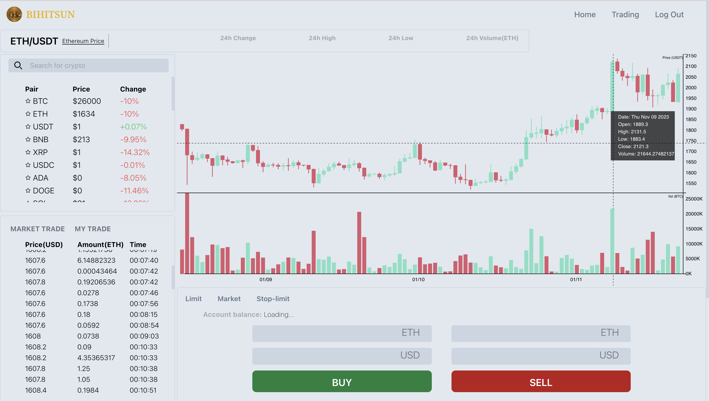
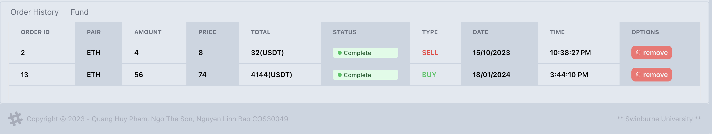
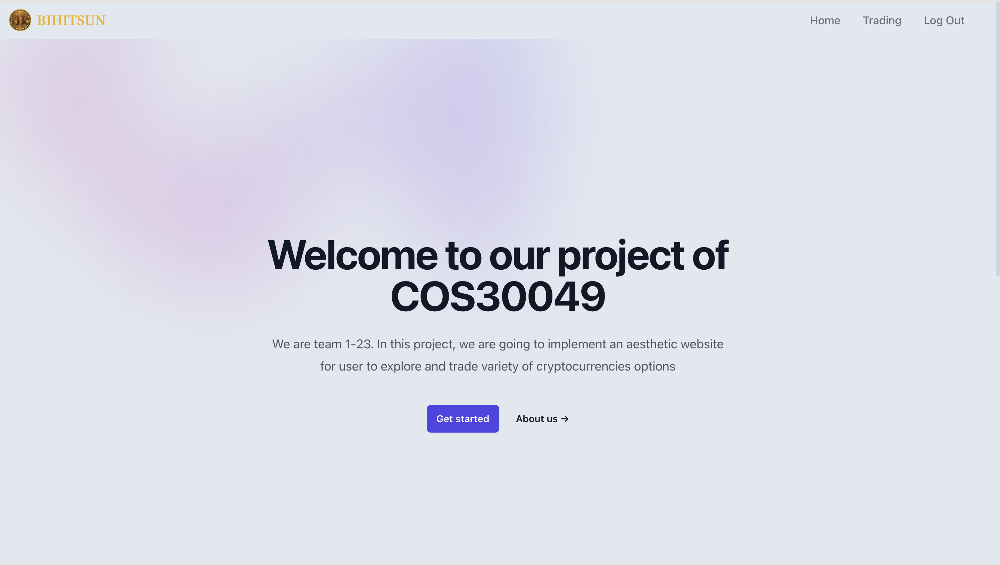
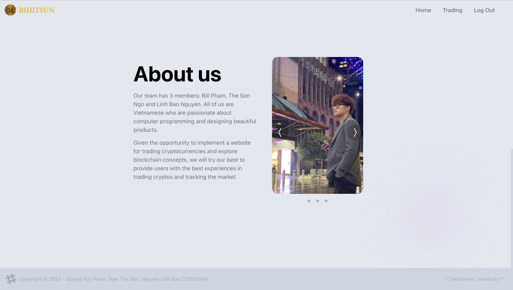

# Full Stack Trading Platform with React, Tailwinds, Nodejs, D3js chart and Solidity smart contract

 
 
 
 
---

this is a repository for a full stack trading platform with React, Nodejs, D3js chart and Solidity smart contract

features:

* Tailwind animation and effect
* Full responsive
* Credential authentication
* Search and filter functionality
* Smart contract
* Buying and Selling
* Error handling with React Toast
* Featured crypto currentcy based on user interest
* D3 candlestick chart
* Crypto price on hover graph (tooltips)
* API design
* Transaction history
* Update user transaction to block chain with smart contract from blockchain 
* Update user crypto currentcy ballance with smart contract from blockchain

---

# Clone the repository

```

git clone https://github.com/bbi3mn4u69/COS30049-Computing_Technology_Innovation_Project.git

```

---

# Install packages

```
npm i

```

---

# Start the development mode

### Install Ganache software

- https://trufflesuite.com/ganache/

### Truffle, Ethereum development framework

```

sudo npm install -g truffle@5.0.2

```

```

truffle init

```

- Set up new workspace on Ganache using truffle-config.js file

### Compile the smart contract

```

truffle compile

```

### Deploy the smart contract

```

truffle migrate

```

### Client side

```

cd client

```

```

npm start

```

### Server side

```

cd server

```

```

npm start

```

---

# contribution thanks to @nguyen_linh_bao; @pham_nguyen_quang_huy; @ngo_the_son; @chung_yi
